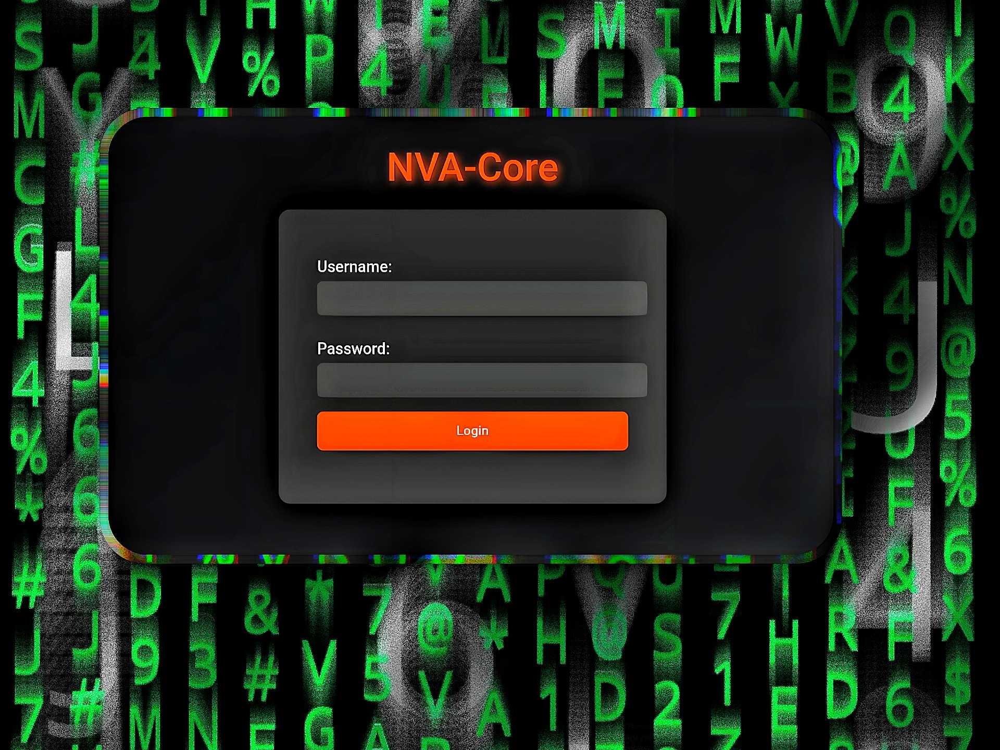
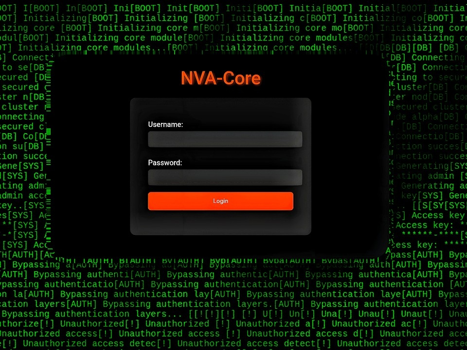

# nva-core
REVERSE PROXY SERVER WITH JWT AUTH RATELIMIT AND SECURITY FEATURE INCLUDING IP BANNING WHITELIST

  

# nva-core

## **NVA-CORE** a **composable security and control fabric** (not just a reverse proxy)
### Footprint < 2MB.

---

## 🧠 The Architecture of NVA-CORE

### Not Just a Proxy — a Modular Security Fabric

At its core, **NVA-CORE** isn’t built just to _forward requests_ — it’s built to **govern digital movement**.  
Every request, every endpoint, every token exchange passes through a composable, event-aware layer that you control — piece by piece, like **digital Lego**.

Instead of being a fixed-function proxy, NVA-CORE acts as a **programmable control layer**.  
You can deploy it as a standalone gateway, a chained security node, or even an inline policy enforcer between microservices.  
The system’s behavior changes based on how you assemble it — from a lightweight HTTP/HTTPS shield to a multi-node defense grid.

---

### ⚙️ Modular by Design — The “Lego” Principle

Every component of NVA-CORE is designed to **snap together cleanly**:

- **Auth Control Blocks**: JWT, API Key, or Signature-based verification, configured per endpoint or per path.
    
- **Network Policy Modules**: IP whitelist, behavior-based blocking, concurrent connection throttling, or adaptive trust scoring.
    
- **Session Chain Handlers**: Optional OTP, token forwarding, or secondary signature validation.
    
- **Runtime Interfaces**: Expose internal metrics, accept external policy updates, or integrate directly with higher-level orchestrators.
    

You can run **a single NVA** for a small-scale edge or **a cluster of NVAs** forming a custom mesh:

- **Load Balancer Fabric** — distribute requests based on JWT claims, tokens.
    
- **Corporate Security Gate** — restrict access per department or IP range with endpoint-based isolation.
    
- **Data Isolation Nodes** — separate public and internal traffic automatically using endpoint behavior rules.
    
- **Multi-Zone Access Map** — where each NVA instance enforces its own trust perimeter while syncing rules globally.
It’s **security as topology** — a modular construct you can scale, stack, or reconfigure without re-writing core code.

    

  

---  

### 🧩 Endpoint-Driven Governance

NVA-CORE operates through the principle of **Endpoint Control** — where every path defines its own security posture. You can add any number of endpoints.

|Endpoint example|Security Layer|Behavior|
|---|---|---|
|`/admin`|JWT / OTP| authentication, failure triggers block.|
|`/public/..`|None or API Key|Public access or token-based filter.|
|`/internal/..`|JWT + IP Whitelist|Restricted to trusted origin IPs only.|
|`/relay/...`|Signature-based (X-Signature / HMAC)|Used for API bridges, automation, or data tunnels.|

**JWT Authentication** supports multiple schemes — Basic, Bearer, APIKey, X-API-Key, HMAC, X-Signature, Opaque Tokens —  
with **RSA**, **ECDSA**, and **Ed25519 (EdDSA)** support for asymmetric verification.  
All verification occurs _per-endpoint_, _per-context_, and _per-session_ — no global blind trust.

**Behavioral Intelligence:**  
When a user fails authentication or behaves abnormally, NVA-CORE tracks the event, adjusts trust metrics, and enforces bans.  
Even whitelisted IPs remain under observation — ensuring no trusted node can abuse its access silently.

---

### 🧠 Concurrency & Adaptive Limits

NVA-CORE isn’t static — it adapts to your infrastructure.  
While the theoretical concurrency cap scales past **1 million connections**, it’s **safety-capped at 5,000** by default — protecting your server from accidental floods while keeping latency near zero.

This means:

- You can stress-test without collapsing the system.
    
- The cap can be lifted or distributed across multiple NVAs in a mesh.
    
- Internal modules can scale horizontally without reconfiguration.
    

---

### 🔧 Control Surface Overview

Operators have **full runtime control** over key layers — including authentication, SSL, and request handling.  
Advanced users can toggle or disable specific protections for staging, internal networks, or automation workflows.

| Layer             | Control                 | Default | Scope    |
| ----------------- | ----------------------- | ------- | -------- |
| Network           | HTTP(S) / Proxy Mode    | Proxy   | Global   |
| SSL               | Auto / Manual / None    | Auto    | Global   |
| Security          | Global Checks           | Enabled | Global   |
| JWT               | Verification / optional | On      | Per-Path |
| OTP               | Validation /optional    | On      | Per-User |
| Concurrency       | Connection Cap          | 5K      | Global   |
| IP Whitelist      | File + Tracking         | On      | Global   |
| Behavior Tracking | Adaptive /optional      | On      | Global   |

---

### 🧩 Deployment Flexibility

You can run NVA-CORE as:

- **Primary Proxy Gateway** — the entry point to your infrastructure. HTTP(S)
    
- **Sub-Proxy Layer** — under another reverse proxy, handling JWT or OTP validation. watching with ip ban and ip white list.
    
- **Internal Service Node** — between microservices to validate tokens and signatures inline.
    
- **Edge Mesh Node** — where multiple NVAs communicate, forming a sustaining stable and secure, distributed perimeter.
    

Each instance can act independently or join a synchronized cluster — scaling from **one binary** to a **full-fledged fabric**.

---

### 🧠 The Big Idea

NVA-CORE turns the proxy model upside-down.  
It’s not a “traffic forwarder” — it’s a **behavioral firewall**, **API governor**, and **runtime guardian**.  
Everything from authentication, concurrency, and adaptive bans to endpoint isolation is **algorithmic**, not static.  
You don’t just _configure_ **NVA-CORE** — you **compose** it.

That’s why it’s called **Agis** —  
because once deployed, it doesn’t just _guard your app_ — it **thinks with it**.

---

Note : we will soon post How to configure and use settings at trendsuggest.com

---

---

## ⚖️ License & Usage
## Read The Updated FUll License here [LICENSE.md](LICENSE.md)
# END USER LICENSE AGREEMENT (EULA)

# ⚠️ THIS IS PAID-ONLY SOFTWARE ⚠️

**NO FREE LICENSE. NO TRIAL. NO EVALUATION. NO EXCEPTIONS.**

Downloading, pulling, installing, or using this binary/Docker image **without purchasing a paid license key** is **UNAUTHORIZED** and constitutes **WILLFUL COPYRIGHT INFRINGEMENT** under the Copyright Act, 1957 (India).

**TO USE THIS SOFTWARE LEGALLY YOU MUST:**  
  
1\. Purchase a license key from \[your payment link or email\]  
2\. Agree to the full terms below

## WARNING – READ BEFORE ANY USE

*   Any use without a paid license is **piracy** and a **criminal offense** (Section 63 Copyright Act).
*   You have **ZERO rights**, **ZERO warranty**, **ZERO support**, and **ZERO claim** against the Licensor if you use this without payment.
*   Reverse engineering, decompiling, modifying, rebranding, reselling or any commercial use without license = **serious legal consequences**.
*   The software may contain telemetry and license validation. Bypassing them = additional breach.

**BY CONTINUING TO USE THIS SOFTWARE YOU CONFIRM:**  
You have **READ** and **UNDERSTOOD** this warning.  
You are **NOT** using it without a paid license.  
You accept all risks and waive all claims against the Licensor.

### Full License Terms → [https://trendsuggest.com/eula](https://trendsuggest.com/eula)

If you have not purchased a license: **DELETE THIS BINARY NOW.**  
Continuing = willful infringement.
